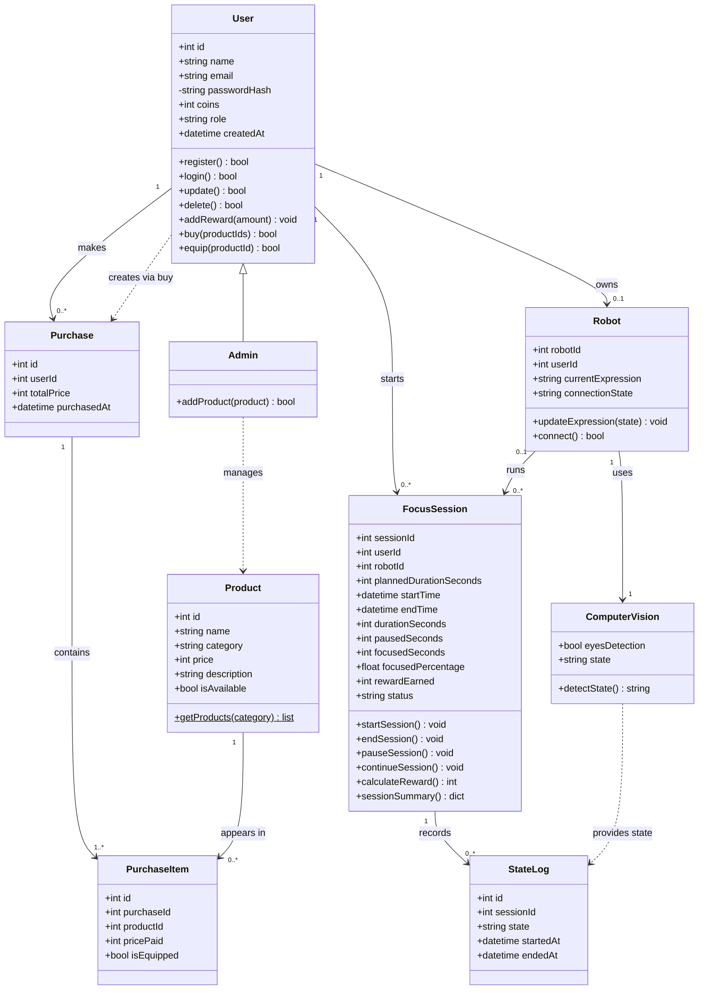
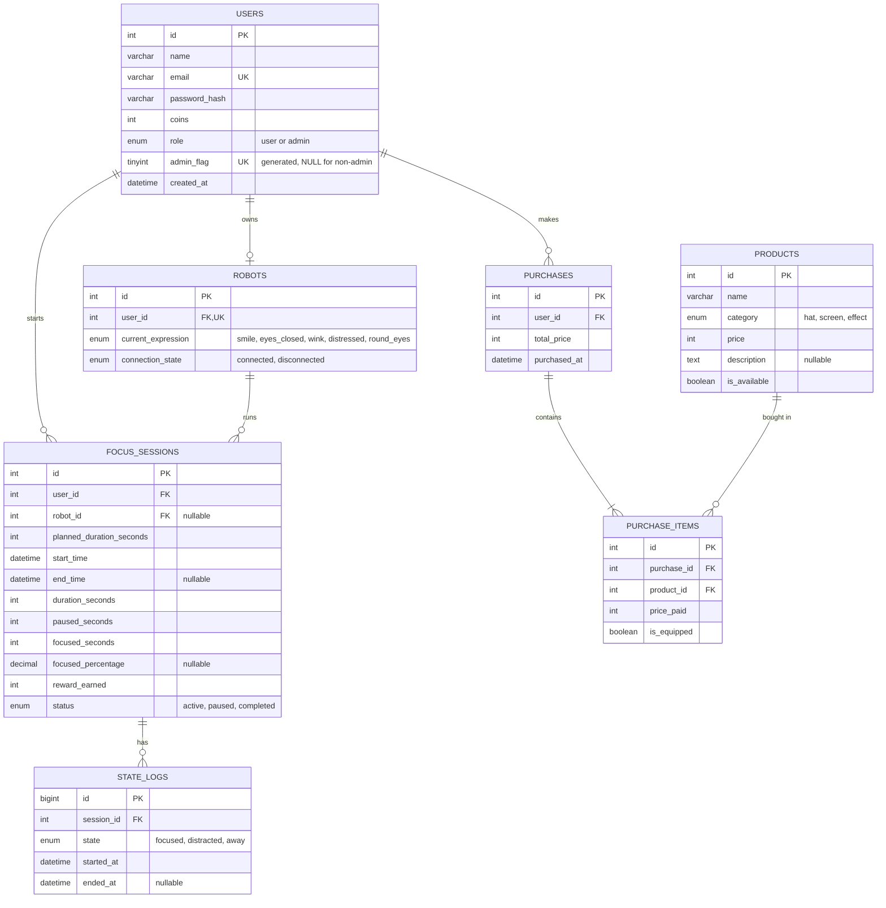

#  Kaboom: Components, Classes, and Database Design
 
This document describes the back-end classes, the database design, and the main front-end components of the FocusRobot system. FocusRobot is a physical robot named Sparky, paired with a mobile app, that helps users stay focused during study or work sessions.
 
**Technology stack:** Spring Boot (backend), Flutter (mobile app), MySQL(database).
 
## Table of Contents
 
1. [Class Diagram](#1-class-diagram)
2. [Class Descriptions](#2-class-descriptions)
3. [ER Diagram](#3-er-diagram)
4. [Database Schema (MySQL 8)](#4-database-schema-mysql-8)
5. [Implementation Notes (Spring Boot)](#5-implementation-notes-spring-boot)
6. [Front-end Components](#6-front-end-components)
7. [Points to Confirm](#7-points-to-confirm)
---
 
## 1. Class Diagram
 

 
---
 
## 2. Class Descriptions
 
### 2.1 User
 
**Purpose:** Represents a person who uses the FocusRobot mobile app. It stores the account information and the coin balance, and it handles everything related to the account, to buying products from the shop, and to equipping the products that the user owns.
 
**Stored in table:** `users`
 
| Attribute | Type | Description |
|---|---|---|
| `id` | int | Unique identifier of the user. |
| `name` | string | The user's display name. |
| `email` | string | The user's email address. It must be unique and is used to log in. |
| `passwordHash` | string | The user's password, stored in hashed form. The plain password is never stored. This attribute is private. |
| `coins` | int | The user's current coin balance. It increases when a session is completed and decreases when the user buys products. It can never be negative. |
| `role` | string | Either `user` or `admin`. |
| `createdAt` | datetime | The date and time when the account was created. |
 
| Method | Returns | Description |
|---|---|---|
| `register()` | bool | Creates a new account after validating the name, email, and password.|
| `login()` | bool | Checks the email and password. If they are correct, the user is authenticated and receives an access token. |
| `update()` | bool | Updates the account information (name, email, or password). |
| `delete()` | bool | Deletes the account together with its robot, sessions, and purchases. |
| `addReward(amount)` | void | Adds the given number of coins to the user's balance. It is called when a focus session ends. |
| `buy(productIds)` | bool | Buys one or more products. It checks that every product is available and not already owned by the user, and that the balance covers the total price. Then it deducts the coins and creates a `Purchase` with one `PurchaseItem` for each product. All of these steps happen in a single transaction, so either everything succeeds or nothing changes. Returns `false` if the balance is not enough or a product cannot be bought. |
| `equip(productId)` | bool | Equips a product that the user owns, so that it appears on the robot. Only one product per category can be equipped at a time, so any other equipped product of the same category is unequipped. Returns `false` if the user does not own the product. |
 
**Relationships:** A user owns at most one robot, starts many focus sessions, and makes many purchases. `Admin` inherits from `User`.
 
---
 
### 2.2 Admin
 
**Purpose:** Represents the administrator of the shop. The system has exactly one admin. The admin is a normal user with `role = 'admin'`, so `Admin` inherits all attributes and methods of `User`.
 
**Stored in table:** `users` (there is no separate table).
 
| Method | Returns | Description |
|---|---|---|
| `addProduct(product)` | bool | Adds a new product to the shop, with its name, category, price, and description. Only the admin can call this method. |
 
**Relationships:** Inherits from `User`. Manages `Product`.
 
**Note:** The database guarantees that only one admin can exist .
 
---
 
### 2.3 FocusSession
 
**Purpose:** Represents one focus session, from the moment the user starts it until it ends. It tracks the time, the paused time, the focused time, and the reward earned.
 
**Stored in table:** `focus_sessions`
 
| Attribute | Type | Description |
|---|---|---|
| `sessionId` | int | Unique identifier of the session. |
| `userId` | int | The user who owns the session. |
| `robotId` | int | The robot used in the session. It can be empty if no robot was connected. |
| `plannedDurationSeconds` | int | The duration chosen by the user before starting, in seconds. |
| `startTime` | datetime | When the session started. |
| `endTime` | datetime | When the session ended. It is empty until the session ends. |
| `durationSeconds` | int | The actual length of the session, in seconds. |
| `pausedSeconds` | int | The total time the session was paused, in seconds. |
| `focusedSeconds` | int | The total time in which the user was focused, in seconds. It is shown as "Time Focused" on the session summary screen. |
| `focusedPercentage` | float | The percentage of the active time in which the user was focused. It is empty until the session ends. |
| `rewardEarned` | int | The number of coins earned from this session. |
| `status` | string | One of `active`, `paused`, or `completed`. |
 
| Method | Returns | Description |
|---|---|---|
| `startSession()` | void | Creates the session with the status `active` and records the start time. |
| `pauseSession()` | void | Pauses an active session. The paused time is not counted as focus time.  |
| `continueSession()` | void | Resumes a paused session and adds the pause length to `pausedSeconds`. |
| `endSession()` | void | Ends the session. It sets the end time and the duration, calculates the focused time, and the reward, and sets the status to `completed`. |
| `calculateReward()` | int | Calculates the number of coins earned, based on the reward rule defined by the team. |
| `sessionSummary()` | dict | Returns the summary shown to the user: the focused time, and the coins earned. |
 
**Focus percentage formula:**
 
```
```
 
**Relationships:** Belongs to one user. May use one robot. Has many `StateLog` records.
 
---
 
### 2.4 StateLog
 
**Purpose:** Records each period in which the user stayed in one state during a session. The user's state can change many times in one session, for example from focused to distracted and back to focused. These records are used to calculate the focused time and the focus percentage.
 
**Stored in table:** `state_logs`
 
| Attribute | Type | Description |
|---|---|---|
| `id` | int | Unique identifier of the record. |
| `sessionId` | int | The session that this record belongs to. |
| `state` | string | One of `focused`, `distracted`, or `away`. |
| `startedAt` | datetime | When the user entered this state. |
| `endedAt` | datetime | When the user left this state. It is empty while this is the current state. |
 
**Meaning of the states:**
 
| State | Meaning |
|---|---|
| `focused` | The user is looking at the work and paying attention. |
| `distracted` | The user is present but not paying attention. |
| `away` | The user is not in front of the camera. |
 
**Relationships:** Belongs to one `FocusSession`. 
 
---
 
### 2.5 Robot
 
**Purpose:** Represents the physical robot that belongs to a user. It shows a face expression on its screen that reflects the user's current state, and it keeps track of whether it is connected to the app. Each user has at most one robot.
 
**Stored in table:** `robots`
 
| Attribute | Type | Description |
|---|---|---|
| `robotId` | int | Unique identifier of the robot. |
| `userId` | int | The user who owns the robot. Each user can have only one. |
| `currentExpression` | string | The face currently shown on the robot's screen. |
| `connectionState` | string | Either `connected` or `disconnected`. |
 
| Method | Returns | Description |
|---|---|---|
| `updateExpression(state)` | void | Changes the robot's face according to the user's state.|
| `connect()` | bool | Pairs the robot with the app and sets `connectionState` to `connected`. Returns `false` if the connection fails. |
 
**Relationships:** Belongs to one user. Runs many focus sessions. Uses one `ComputerVision` module.
 
---
 
### 2.6 ComputerVision
 
**Purpose:** The module that analyzes the camera image and decides the user's current state. It works with live images only. It does not store any video or photo, and only the resulting state is saved in `state_logs`.
 
**Stored in table:** None. This is a logic class only.
 
| Attribute | Type | Description |
|---|---|---|
| `eyesDetection` | bool | Whether the user's eyes are detected in the current camera image. |
| `state` | string | The state detected most recently: `focused`, `distracted`, or `away`. |
 
| Method | Returns | Description |
|---|---|---|
| `detectState()` | string | Analyzes the current camera image and returns `focused`, `distracted`, or `away`. The exact detection rules are defined by the Computer Vision team. For example, no face in the image means `away`. |
 
**Relationships:** Used by one `Robot`. Provides the state that is recorded in `StateLog`.
 
---
 
### 2.7 Product
 
**Purpose:** Represents an item that users can buy in the shop with their coins

**Stored in table:** `products`
 
| Attribute | Type | Description |
|---|---|---|
| `id` | int | Unique identifier of the product. |
| `name` | string | The product name. |
| `category` | string | One of `hat`, `screen`, or `effect`. It matches the shop tabs Hats, Screens, and Kaboom FX. |
| `price` | int | The price in coins. It must be greater than zero. |
| `description` | string | An optional description of the product. |
| `isAvailable` | bool | Whether the product can currently be bought.|
 
| Method | Returns | Description |
|---|---|---|
| `getProducts(category)` | list | A static method that returns all available products to show in the shop. If a category is given, it returns only the products of that category. |
 
**Relationships:** Added and managed by `Admin`. Appears in many `PurchaseItem` records.
 
---
 
### 2.8 Purchase
 
**Purpose:** Represents one purchase made by a user. A single purchase can include several products. The products themselves are stored in `PurchaseItem`.
 
**Stored in table:** `purchases`
 
| Attribute | Type | Description |
|---|---|---|
| `id` | int | Unique identifier of the purchase. |
| `userId` | int | The user who made the purchase. |
| `totalPrice` | int | The total number of coins paid for the whole purchase. |
| `purchasedAt` | datetime | When the purchase was made. |
 
**Relationships:** Belongs to one user. Contains one or more `PurchaseItem` records.
 
---
 
### 2.9 PurchaseItem
 
**Purpose:** Links a purchase to a product. It exists because the relationship between purchases and products is many-to-many: one purchase can include many products, and one product can appear in many purchases. It also stores the price paid, so the purchase history stays correct even if the product price changes later. 
 
**Stored in table:** `purchase_items`
 
| Attribute | Type | Description |
|---|---|---|
| `id` | int | Unique identifier of the item. |
| `purchaseId` | int | The purchase that this item belongs to. |
| `productId` | int | The product that was bought. |
| `pricePaid` | int | The price of the product at the time of the purchase. |
| `isEquipped` | bool | Whether the user has currently equipped this product on the robot. The default is `false`. |
 
**Relationships:** Belongs to one `Purchase` and one `Product`.
 
---
 
## 3. ER Diagram
 

 
**Key**
 
| Abbreviation | Meaning |
|---|---|
| PK | Primary Key: uniquely identifies each row. |
| FK | Foreign Key: refers to a row in another table. |
| UK | Unique Key: the value cannot be repeated in another row. |
 
**Relationships**
 
| Relationship | Meaning |
|---|---|
| User 1 : 0..1 Robot | Each user has at most one robot. |
| User 1 : N FocusSession | A user can start many sessions. |
| Robot 0..1 : N FocusSession | A session can use one robot, or none. |
| FocusSession 1 : N StateLog | A session records many state changes. |
| User 1 : N Purchase | A user can make many purchases. |
| Purchase 1 : N PurchaseItem | A purchase contains one or more items. |
| Product 1 : N PurchaseItem | A product can appear in many purchases. |
| Purchase M : N Product | Resolved through the `purchase_items` table. |
 
---
 
## 4. Database Schema 
 
Create the tables in the order shown, because later tables depend on earlier ones through foreign keys. 
 
```sql
CREATE TABLE users (
    id INT AUTO_INCREMENT PRIMARY KEY,
    name VARCHAR(100) NOT NULL,
    email VARCHAR(255) NOT NULL UNIQUE,
    password_hash VARCHAR(255) NOT NULL,
    coins INT NOT NULL DEFAULT 0 CHECK (coins >= 0),
    role ENUM('user','admin') NOT NULL DEFAULT 'user',
    admin_flag TINYINT GENERATED ALWAYS AS (IF(role = 'admin', 1, NULL)) VIRTUAL,
    created_at DATETIME NOT NULL DEFAULT CURRENT_TIMESTAMP,
    UNIQUE KEY uq_single_admin (admin_flag)
);
 
CREATE TABLE robots (
    id INT AUTO_INCREMENT PRIMARY KEY,
    user_id INT NOT NULL UNIQUE,
    current_expression ENUM('smile','eyes_closed','wink','distressed','round_eyes') NOT NULL DEFAULT 'smile',
    connection_state ENUM('connected','disconnected') NOT NULL DEFAULT 'disconnected',
    FOREIGN KEY (user_id) REFERENCES users(id) ON DELETE CASCADE
);
 
CREATE TABLE focus_sessions (
    id INT AUTO_INCREMENT PRIMARY KEY,
    user_id INT NOT NULL,
    robot_id INT NULL,
    planned_duration_seconds INT NOT NULL DEFAULT 1800,
    start_time DATETIME NOT NULL,
    end_time DATETIME NULL,
    duration_seconds INT NOT NULL DEFAULT 0,
    paused_seconds INT NOT NULL DEFAULT 0,
    focused_seconds INT NOT NULL DEFAULT 0,
    focused_percentage DECIMAL(5,2) NULL,
    reward_earned INT NOT NULL DEFAULT 0,
    status ENUM('active','paused','completed') NOT NULL DEFAULT 'active',
    FOREIGN KEY (user_id) REFERENCES users(id) ON DELETE CASCADE,
    FOREIGN KEY (robot_id) REFERENCES robots(id) ON DELETE SET NULL
);
 
CREATE TABLE state_logs (
    id BIGINT AUTO_INCREMENT PRIMARY KEY,
    session_id INT NOT NULL,
    state ENUM('focused','distracted','away') NOT NULL,
    started_at DATETIME NOT NULL,
    ended_at DATETIME NULL,
    FOREIGN KEY (session_id) REFERENCES focus_sessions(id) ON DELETE CASCADE
);
 
CREATE TABLE products (
    id INT AUTO_INCREMENT PRIMARY KEY,
    name VARCHAR(100) NOT NULL,
    category ENUM('hat','screen','effect') NOT NULL,
    price INT NOT NULL CHECK (price > 0),
    description TEXT NULL,
    is_available BOOLEAN NOT NULL DEFAULT TRUE
);
 
CREATE TABLE purchases (
    id INT AUTO_INCREMENT PRIMARY KEY,
    user_id INT NOT NULL,
    total_price INT NOT NULL,
    purchased_at DATETIME NOT NULL DEFAULT CURRENT_TIMESTAMP,
    FOREIGN KEY (user_id) REFERENCES users(id) ON DELETE CASCADE
);
 
CREATE TABLE purchase_items (
    id INT AUTO_INCREMENT PRIMARY KEY,
    purchase_id INT NOT NULL,
    product_id INT NOT NULL,
    price_paid INT NOT NULL,
    is_equipped BOOLEAN NOT NULL DEFAULT FALSE,
    UNIQUE KEY uq_purchase_product (purchase_id, product_id),
    FOREIGN KEY (purchase_id) REFERENCES purchases(id) ON DELETE CASCADE,
    FOREIGN KEY (product_id) REFERENCES products(id) ON DELETE RESTRICT
);
```

 
## 5. Front-end Components
 
The mobile app is built with Flutter. It uses the font **Readex Pro** for text and **JetBrains Mono** for timers and numbers. The main screens and their interactions are:
 
- **Sign Up Screen:** Lets a new user create an account with a name, email, and password, and then moves the user to the Login screen.
- **Login Screen:** Lets the user sign in with an email and password and moves the user to the Homepage. 
- **Homepage:** Shows the robot face, the "Ready to Focus?" timer, and the Start Session button. It also opens the side menu.
- **Focus Session Screen:** Shows the countdown timer, the user's current state (focused, distracted, or away) through a status chip and the robot face, and an End Session button. It updates the state every few seconds. 
- **Session Complete Screen:** Shows a celebration animation, the time focused, and the coins earned, with buttons that lead to the Shop or back to the Homepage.
- **Shop Screen:** Shows the coin balance, the category filters (All, Hats, Screens, and Kaboom FX), and the product cards, and lets the user buy a product. Products that the user has equipped show the label "Equipped".
- **Robot Connection Screen :** Scans for nearby robots and pairs the app with the user's robot.
- **Progress / History Screen :** Lists the user's past sessions with their focused time and coins.
- **Add Product Screen (admin only):** Lets the admin add a product to the shop.

**Reusable components:**
 
- **RobotFace:** Shows one of the five robot faces.
- **StatusChip:** Shows the current state with an icon (Focused, Distracted, or Away).
- **CircularTimer:** Shows a progress ring with the time in the center.
- **PrimaryButton and SecondaryButton:** The filled and the outlined buttons.
- **AppTextField:** An input field with a label, an icon, and a placeholder.
- **FilterChip:** A selectable chip used for the shop categories.
- **ProductCard:** Shows a product preview, its name, and its price or the label "Equipped".
- **CoinBadge:** Shows the coin balance.
- **SummaryCard:** Shows the time focused and the coins earned.
- **ConfettiOverlay:** The celebration animation.
- **HamburgerButton and BackButton:** Open the side menu and return to the previous screen.
