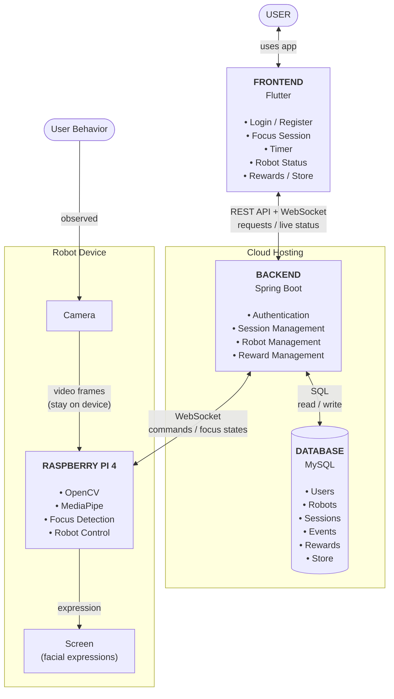
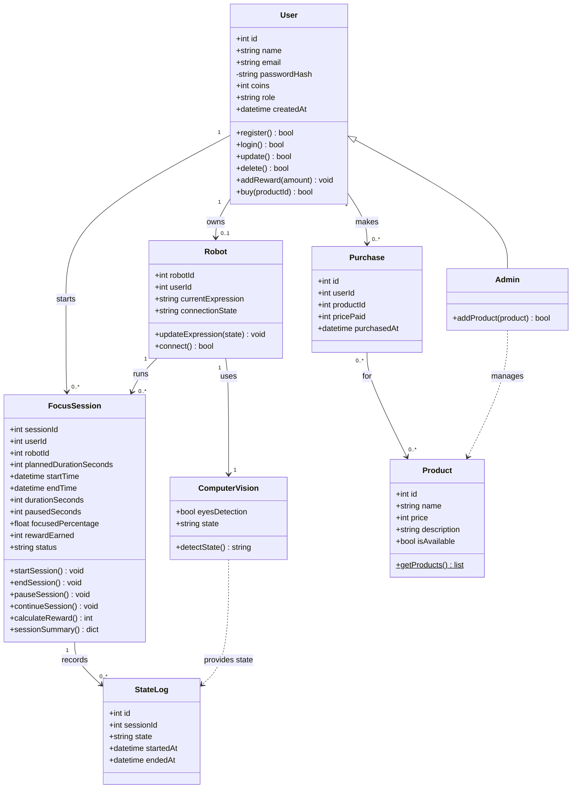
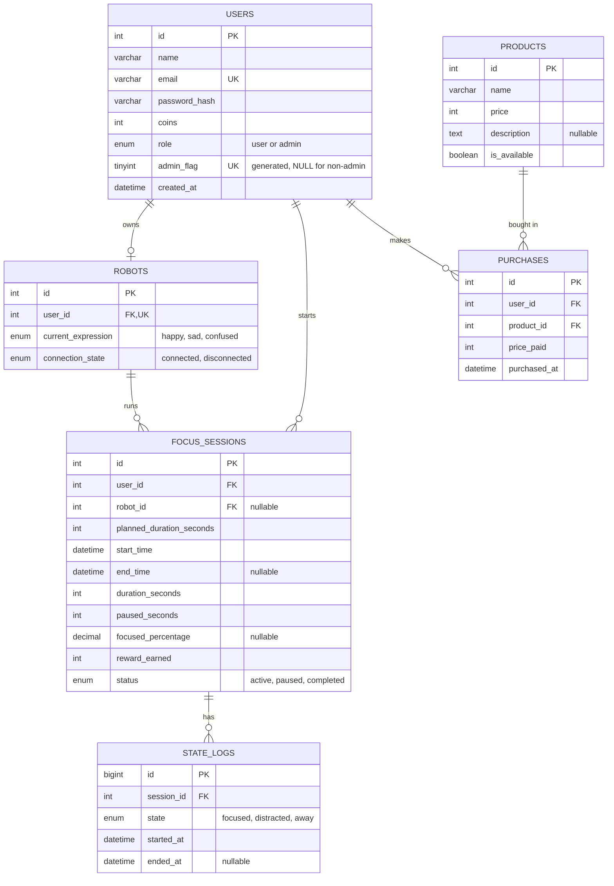
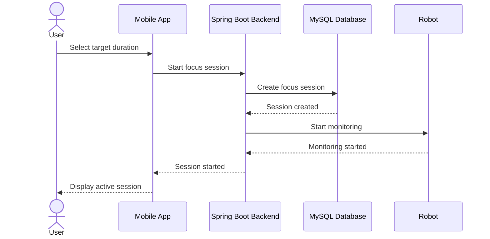
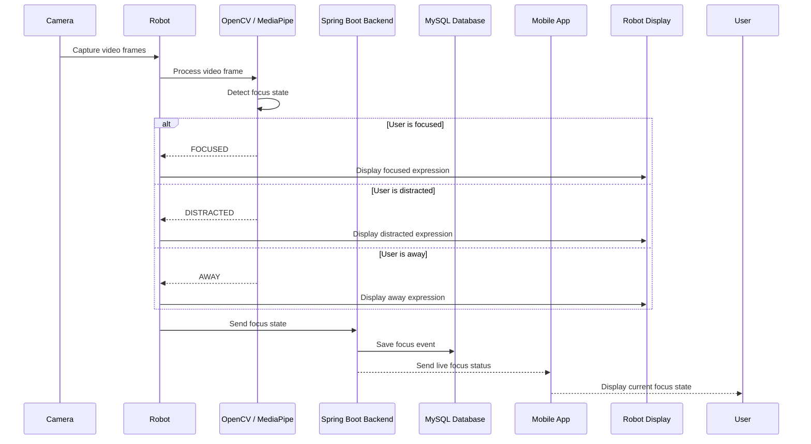
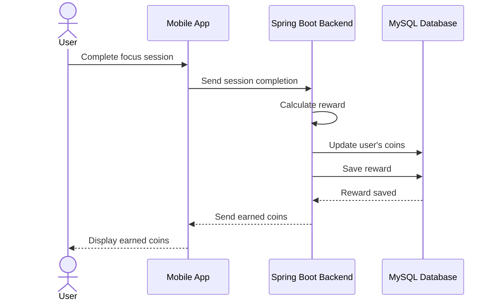

# Kaboom! — Technical Documentation

## Table of Contents

1. [User Stories and Mockups](#1-user-stories-and-mockups)
   - [User Stories (MoSCoW)](#user-stories-moscow)
   - [Mockups](#mockups)
2. [System Architecture](#1-system-architecture)
3. [Class Diagram](#2-class-diagram)
4. [ER Diagram](#3-er-diagram)
5. [Database Schema (MySQL 8)](#4-database-schema-mysql-8)
6. [API Mapping](#4-api-mapping)
7. [API Specifications](#5-api-specifications)
   - [API Style and Authentication](#51-api-style-and-authentication)
   - [External APIs and Local Technology Integrations](#52-external-apis-and-local-technology-integrations)
   - [Robot Pairing and Device Access](#53-robot-pairing-and-device-access)
   - [Internal API Endpoint Contracts](#54-internal-api-endpoint-contracts)
   - [Key Request and Response Examples](#55-key-request-and-response-examples)
   - [Session and Reward Rules](#56-session-and-reward-rules)
   - [Live Updates](#57-live-updates)
   - [Error Response Format](#58-error-response-format)
   - [Database Alignment Required for These Endpoints](#59-database-alignment-required-for-these-endpoints)
8. [SCM and QA Plan](#6-scm-and-qa-plan)
   - [Source Control Management](#61-source-control-management)
   - [QA Strategy](#62-qa-strategy)
   - [Detection Accuracy Evaluation](#63-detection-accuracy-evaluation)
   - [Critical Test Scenarios](#64-critical-test-scenarios)
   - [Continuous Integration and Deployment](#65-continuous-integration-and-deployment)
   - [Technical Justification](#66-technical-justification)

## 1. User Stories and Mockups

### User Stories (MoSCoW)

### Must Have
1. As a user, I want to register as a new user, so that I can create an account and use the application.

2. As a user, I want to log in with my email and password, so that I can securely access my account, my robot, and my session history.

3. As a user, I want to connect my mobile app to the robot, so that the app can communicate with and control my robot during focus sessions.

4. As a user, I want to start a focus session and select a target duration, so that I can begin working with a clear, time-bound goal.

5. As a user, I want the robot to detect whether I'm FOCUSED, DISTRACTED, or AWAY, so that my attention is tracked accurately without manual input.

6. As a user, I want the robot's screen to show a facial expression matching my current focus state, so that I get immediate, non-intrusive feedback.

7. As a user, I want to see my live session status in the mobile app, so that I can monitor progress alongside the robot's feedback.

8. As a user, I want to receive coins when I complete a session, so that I feel rewarded for staying focused.

9. As a user, I want the app to confirm when a session ends (completed or cut short), so that I know the outcome clearly.
   
10. As a user, I want to spend earned coins to customize the robot with clothes and accessories, so that I feel a sense of progression and ownership.

11. As a user, I want a short summary after each session (e.g., time focused vs. distracted), so that I understand how well I actually focused.

### Should Have
1. As a user, I want to view a history of past sessions, so that I can track my focus trends over time.

2. As a user, I want to pause a session, so that I can take a short break without losing my progress or streak.

3. As a user, I want different expression "themes" for the robot, so that I can personalize how it communicates with me.

### Could Have
1. As a user, I want to set daily or weekly focus goals, so that I can build consistent study habits.

2. As a user, I want to compare my stats with friends, so that I stay motivated through light competition.

3. As a user, I want a gentle audio or light cue when I'm distracted, so that I can self-correct without a jarring interruption.

### Won't Have
1. As a user, I want the robot to physically move or gesture, so that it feels more lifelike — out of scope for a simple 3D-printed prototype.

2. As a user, I want the robot to sync with third-party calendars, so that sessions are scheduled automatically.

3. As a user, I want multiple user profiles on one robot, so that my family/roommates can each track their own sessions.

4. As a user, I want voice control, so that I can start/stop sessions hands-free.

### Mockups

Interactive Figma prototype: [Kaboom! (Kaboom) Mockups](https://www.figma.com/design/av0ip8R6icJggihhZaXFMo/Kaboom-?node-id=1-3&p=f&t=6P1tw5wPOf7ddRQe-0)

#### Mockup overview

| Screen | Preview | Covers |
|---|---|---|
| Sign Up |  | Must Have 1 (register) |
| Login |  | Must Have 2 (account access) |
| Connect |  | Must Have 2 (pair the robot with the app) |
| Homepage |  | Must Have 3 (select a target duration and start a session) |
| Focused Status in Session |  | Must Have 4, 5, 6 (focus state, expression, live status) |
| Distracted Status in Session |  | Must Have 4, 5, 6 |
| Session Complete |  | Must Have 7, 8, 10 (coins earned, outcome, summary) |
| Shop |  | Must Have 9 (spend coins on hats, screens and effects) |


## 2. System Architecture

**Tech stack:** MySQL 8 (database)




## 3. Components, Classes, and Database Design

### Class Diagram



---

### ER Diagram



**Relationships**

- User 1 : 0..1 Robot
- User 1 : N FocusSession
- Robot 1 : N FocusSession
- FocusSession 1 : N StateLog
- User M : N Product (through `purchases`)

---

### Database Schema (MySQL 8)

Create the tables in this order because of the foreign keys.

```sql
CREATE TABLE users (
    id INT AUTO_INCREMENT PRIMARY KEY,
    name VARCHAR(100) NOT NULL,
    email VARCHAR(255) NOT NULL UNIQUE,
    password_hash VARCHAR(255) NOT NULL,
    coins INT NOT NULL DEFAULT 0 CHECK (coins >= 0),
    role ENUM('user','admin') NOT NULL DEFAULT 'user',
    admin_flag TINYINT GENERATED ALWAYS AS (IF(role = 'admin', 1, NULL)) VIRTUAL,
    created_at DATETIME NOT NULL DEFAULT CURRENT_TIMESTAMP,
    UNIQUE KEY uq_single_admin (admin_flag)
);

CREATE TABLE robots (
    id INT AUTO_INCREMENT PRIMARY KEY,
    user_id INT NOT NULL UNIQUE,
    current_expression ENUM('happy','sad','confused') NOT NULL DEFAULT 'happy',
    connection_state ENUM('connected','disconnected') NOT NULL DEFAULT 'disconnected',
    FOREIGN KEY (user_id) REFERENCES users(id) ON DELETE CASCADE
);

CREATE TABLE focus_sessions (
    id INT AUTO_INCREMENT PRIMARY KEY,
    user_id INT NOT NULL,
    robot_id INT NULL,
    planned_duration_seconds INT NOT NULL DEFAULT 1800,
    start_time DATETIME NOT NULL,
    end_time DATETIME NULL,
    duration_seconds INT NOT NULL DEFAULT 0,
    paused_seconds INT NOT NULL DEFAULT 0,
    focused_percentage DECIMAL(5,2) NULL,
    reward_earned INT NOT NULL DEFAULT 0,
    status ENUM('active','paused','completed') NOT NULL DEFAULT 'active',
    FOREIGN KEY (user_id) REFERENCES users(id) ON DELETE CASCADE,
    FOREIGN KEY (robot_id) REFERENCES robots(id) ON DELETE SET NULL
);

CREATE TABLE state_logs (
    id BIGINT AUTO_INCREMENT PRIMARY KEY,
    session_id INT NOT NULL,
    state ENUM('focused','distracted','away') NOT NULL,
    started_at DATETIME NOT NULL,
    ended_at DATETIME NULL,
    FOREIGN KEY (session_id) REFERENCES focus_sessions(id) ON DELETE CASCADE
);

CREATE TABLE products (
    id INT AUTO_INCREMENT PRIMARY KEY,
    name VARCHAR(100) NOT NULL,
    price INT NOT NULL CHECK (price > 0),
    description TEXT NULL,
    is_available BOOLEAN NOT NULL DEFAULT TRUE
);

CREATE TABLE purchases (
    id INT AUTO_INCREMENT PRIMARY KEY,
    user_id INT NOT NULL,
    product_id INT NOT NULL,
    price_paid INT NOT NULL,
    purchased_at DATETIME NOT NULL DEFAULT CURRENT_TIMESTAMP,
    FOREIGN KEY (user_id) REFERENCES users(id) ON DELETE CASCADE,
    FOREIGN KEY (product_id) REFERENCES products(id) ON DELETE RESTRICT
);
```
## 4. Sequence Diagrams





---

## 5. API Specifications

| Action | Endpoint |
|---|---|
| Register / Login | `POST /auth/register` / `POST /auth/login` |
| User data | `GET/PUT/DELETE /users/me` |
| Robot | `POST /robot/connect`, `GET /robot` |
| Start session | `POST /sessions` |
| Pause / Continue / End | `PATCH /sessions/{id}/pause`, `/continue`, `/end` |
| History and summary | `GET /sessions`, `GET /sessions/{id}` |
| Products | `GET /products`, `POST /products` (admin) |
| Purchase | `POST /purchases` |

### 5.1 API Style and Authentication

Kaboom! uses a REST API built with Spring Boot. REST endpoints use JSON request and response bodies over HTTPS. The Flutter mobile app and Raspberry Pi communicate with the Spring Boot backend. The Raspberry Pi does not communicate directly with the Flutter app.

REST base path:

```text
/api/v1
```

User endpoints require a user JWT access token:

```text
Authorization: Bearer <user_access_token>
```

The Raspberry Pi is a device, not a user. It receives a device JWT during pairing. A device JWT contains a `robotId` claim and can only submit data for that robot.

### 5.2 External APIs and Local Technology Integrations

The MVP uses no third party cloud API.

The following local technologies are used on the Raspberry Pi:

| Technology | Purpose | Reason for selection |
| --- | --- | --- |
| OpenCV | Capture and process camera frames | Reliable computer vision support for Raspberry Pi. |
| MediaPipe | Detect face and eye landmarks | Efficient prebuilt models for focus related behavior detection. |
| STOMP over WebSocket | Send live backend updates to Flutter | Supported by Spring Boot and suitable for authenticated live updates. |

Camera frames are processed on the Raspberry Pi and are not stored in the backend. The Pi sends only the detected state and its metadata.

The Pi sends one event when the state changes and sends a heartbeat every 30 seconds during an active session. It does not send one request for every camera frame.

### 5.3 Robot Pairing and Device Access

1. An authenticated user creates a temporary pairing code.
2. The user enters the pairing code into the Raspberry Pi setup screen.
3. The Pi pairs with the Spring Boot backend using its serial number and pairing code.
4. The backend returns a robot identifier, device access token, and device refresh token.
5. The Pi stores its tokens securely and uses the device access token for robot endpoints.

Pairing code endpoint:

```text
POST /api/v1/robots/pairing-codes
```

Robot pairing endpoint:

```text
POST /api/v1/robots/pair
```

A pairing code can be used once and expires after ten minutes. If a device token does not match the robot identifier in the URL, the backend returns `403 Forbidden`.

### 5.4 Internal API Endpoint Contracts

#### Authentication and User Endpoints

| Method and path | Access | Input JSON | Output JSON |
| --- | --- | --- | --- |
| `POST /auth/register` | Public | `name`, `email`, `password` | `message`, `user` |
| `POST /auth/login` | Public | `email`, `password` | `accessToken`, `refreshToken`, `expiresInSeconds`, `user` |
| `POST /auth/refresh` | Refresh token | `refreshToken` | `accessToken`, `expiresInSeconds` |
| `POST /auth/logout` | User or device token | `refreshToken` | `message` |
| `GET /users/me` | User JWT | None | `id`, `name`, `email`, `coins`, `role` |
| `PUT /users/me` | User JWT | Optional `name`, `email`, `password` | Updated `user` |
| `DELETE /users/me` | User JWT | None | `message` |

#### Robot Endpoints

| Method and path | Access | Input JSON or query | Output JSON |
| --- | --- | --- | --- |
| `POST /robots/pairing-codes` | User JWT | None | `pairingCode`, `expiresAt` |
| `POST /robots/pair` | Valid pairing code | `serialNumber`, `pairingCode` | `robotId`, `deviceAccessToken`, `deviceRefreshToken`, `expiresInSeconds` |
| `GET /robots/me` | User JWT | None | `id`, `currentExpression`, `connectionState` |
| `GET /robots/me/active-session` | Device JWT | None | `sessionId`, `plannedDurationSeconds`, `startTime`, `status`; or `204 No Content` |
| `POST /robots/{robotId}/focus-states` | Device JWT with matching robot claim | `sessionId`, `state`, `timestamp`, `sequenceNumber`, `eventType` | `message`, `robotExpression`, `acceptedSequenceNumber` |
| `POST /robots/{robotId}/disconnect` | User JWT and owner check | None | `message` |

The Pi checks `GET /robots/me/active-session` every five seconds. A returned active session starts local monitoring. A `204 No Content` response means no session is active.

The `focus-states` endpoint accepts `STATE_CHANGE` or `HEARTBEAT` values for `eventType`. `state` must be `FOCUSED`, `DISTRACTED`, or `AWAY`.

#### Focus Session Endpoints

| Method and path | Access | Input JSON or query | Output JSON |
| --- | --- | --- | --- |
| `POST /sessions` | User JWT | `robotId`, `plannedDurationSeconds` | `id`, `robotId`, `plannedDurationSeconds`, `startTime`, `status` |
| `PATCH /sessions/{id}/pause` | User JWT and owner check | None | Updated session `status` |
| `PATCH /sessions/{id}/resume` | User JWT and owner check | None | Updated session `status` |
| `PATCH /sessions/{id}/end` | User JWT and owner check | None | `status`, `durationSeconds`, `focusedPercentage`, `rewardEarned`, `totalCoins` |
| `GET /sessions?page=0&size=20&sort=startTime,desc` | User JWT | Pagination query parameters | `content`, `page`, `size`, `totalElements`, `totalPages` |
| `GET /sessions/{id}` | User JWT and owner check | None | Session summary and state statistics |

#### Store and Purchase Endpoints

| Method and path | Access | Input JSON or query | Output JSON |
| --- | --- | --- | --- |
| `GET /products` | User JWT | None | Available product list |
| `POST /products` | Admin JWT only | `name`, `price`, optional `description` | Created product |
| `POST /purchases` | User JWT | `productId` | `purchase`, `remainingCoins` |
| `GET /purchases?page=0&size=20` | User JWT | Pagination query parameters | Paginated purchase history |
| `GET /users/me/items` | User JWT | None | Previously purchased products |

`POST /products` checks the existing `role` field. Only a user with `role = admin` can create a product. All other users receive `403 Forbidden`.

### 5.5 Key Request and Response Examples

#### Log in

```text
POST /api/v1/auth/login
```

```json
{
  "email": "user@example.com",
  "password": "SecurePassword123"
}
```

```json
{
  "accessToken": "user_access_token",
  "refreshToken": "user_refresh_token",
  "tokenType": "Bearer",
  "expiresInSeconds": 900,
  "user": {
    "id": 1,
    "name": "Example User",
    "coins": 120,
    "role": "user"
  }
}
```

#### Pair a robot

```text
POST /api/v1/robots/pair
```

```json
{
  "serialNumber": "KABOOM-PI-001",
  "pairingCode": "483921"
}
```

```json
{
  "robotId": 1,
  "deviceAccessToken": "device_access_token",
  "deviceRefreshToken": "device_refresh_token",
  "expiresInSeconds": 900
}
```

#### Start a focus session

```text
POST /api/v1/sessions
```

```json
{
  "robotId": 1,
  "plannedDurationSeconds": 1800
}
```

```json
{
  "id": 25,
  "robotId": 1,
  "plannedDurationSeconds": 1800,
  "startTime": "2026-10-07T14:00:00Z",
  "status": "active"
}
```

#### Send a focus state from the Raspberry Pi

```text
POST /api/v1/robots/1/focus-states
```

```json
{
  "sessionId": 25,
  "state": "FOCUSED",
  "timestamp": "2026-10-07T14:05:30Z",
  "sequenceNumber": 42,
  "eventType": "STATE_CHANGE"
}
```

```json
{
  "message": "Focus state recorded successfully",
  "robotExpression": "happy",
  "acceptedSequenceNumber": 42
}
```

#### End a focus session

```text
PATCH /api/v1/sessions/25/end
```

```json
{
  "id": 25,
  "status": "completed",
  "durationSeconds": 1800,
  "focusedPercentage": 88.5,
  "rewardEarned": 26,
  "totalCoins": 146
}
```

### 5.6 Session and Reward Rules

1. A user may have only one active or paused focus session. Starting another session returns `409 Conflict`.
2. Only an active session can be paused. Pausing an already paused or completed session returns `409 Conflict`.
3. Only a paused session can be resumed. Resuming an active or completed session returns `409 Conflict`.
4. Only an active or paused session can be ended. Ending an already completed session returns `409 Conflict`.
5. A user can access only their own sessions. An attempt to access another user session returns `404 Not Found`.

The Spring Boot backend calculates rewards. The Flutter app and Raspberry Pi never calculate or submit a reward amount.

```text
rewardEarned = min(30, floor(focusedDurationSeconds / 60))
```

The backend derives `focusedDurationSeconds` from timestamped state intervals. Paused time does not count. Sessions shorter than 60 seconds earn zero coins. The maximum reward per session is 30 coins.

For a 30 minute session with 88.5 percent focus, the user has approximately 1,593 focused seconds and earns 26 coins.

### 5.7 Live Updates

Spring Boot is the STOMP over WebSocket server. The Pi posts states to the REST API. The backend publishes live session updates to Flutter.

The Flutter app connects to:

```text
/ws
```

The app supplies its user JWT in the STOMP `CONNECT` header. Spring Security validates the token. The app subscribes to its own session updates only:

```text
/user/queue/sessions/{sessionId}
```

The backend verifies that the authenticated user owns the session before allowing the subscription or publishing updates.

### 5.8 Error Response Format

```json
{
  "timestamp": "2026-10-07T14:10:00Z",
  "status": 400,
  "error": "Bad Request",
  "message": "Validation failed",
  "path": "/api/v1/sessions",
  "fieldErrors": [
    {
      "field": "plannedDurationSeconds",
      "message": "must be greater than zero"
    }
  ]
}
```

Common status codes are `200` for success, `201` for creation, `204` for no active session, `400` for invalid input, `401` for missing or invalid authentication, `403` for insufficient permission, `404` for unavailable resources, `409` for conflicts, and `500` for unexpected server errors.

### 5.9 Database Alignment Required for These Endpoints

The existing Stage 3 schema already includes `users`, `robots`, `focus_sessions`, `state_logs`, `products`, and `purchases`. To fully support the API contracts above, the database design owner must add the following before implementation:

1. A unique `serial_number` field in `robots` for device pairing.
2. A `pairing_codes` table containing code, user identifier, expiration time, and used status.
3. A `refresh_tokens` table containing a hashed token, token type, owner identifier, expiry time, and revocation status.
4. `sequence_number` and `event_type` fields in `state_logs`.
5. A uniqueness rule for `session_id` and `sequence_number` in `state_logs` to prevent duplicate buffered events.

These additions support the same existing project scope and do not change the core entity relationships.

## 6. SCM and QA Plan

### 6.1 Source Control Management

The team uses Git and GitHub.

| Branch | Purpose |
| --- | --- |
| `main` | Stable release ready code only. |
| `develop` | Shared integration branch. |
| `feature/<feature-name>` | New feature development. |
| `fix/<issue-name>` | Bug fixes. |
| `docs/<topic>` | Documentation changes. |

Examples:

```text
feature/user-authentication
feature/focus-session-api
feature/robot-state-detection
feature/flutter-session-screen
fix/coin-calculation
docs/api-specifications
```

Each contributor creates a branch from `develop`, makes focused commits, and opens a pull request to `develop`. At least one teammate must approve the pull request before merge.

At a release milestone, the team creates a release pull request from `develop` to `main`. It requires passing CI checks, one approval, and a successful final demo smoke test.

`main` and `develop` are protected branches. Direct pushes are disabled. Pull requests require passing checks and one approval.

### 6.2 QA Strategy

| Test area | Tool or method | Coverage |
| --- | --- | --- |
| Backend unit tests | JUnit 5 and Mockito | Reward calculation, pairing expiry, session rules, and authorization. |
| Backend integration tests | Spring Boot Test with MySQL compatible test database | Authentication, endpoint contracts, and database persistence. |
| API tests | Postman | Inputs, outputs, validation, authentication, and error responses. |
| Flutter tests | Flutter test framework | Timer logic, state management, and user interface widgets. |
| Pi unit tests | Pytest | State filtering, heartbeat timing, buffering, and sequence numbering. |
| Pi linting | Ruff or Flake8 | Python style and common errors. |
| Hardware tests | Raspberry Pi, camera, and display | Detection state, connection, and robot expressions. |
| End to end tests | Manual scenario checklist | Login, focus session, reward, and purchase flow. |

### 6.3 Detection Accuracy Evaluation

Stage 2 requires at least 80 percent correct focus detection across five users. The team will evaluate that goal using the following test matrix. Each condition is tested at least three times per user and recorded as correct or incorrect.

| Condition | Test cases | Expected outcome |
| --- | --- | --- |
| Lighting | Bright indoor, dim, side light | Stable state or reduced confidence. |
| Glasses | With and without glasses | Face and eye detection works where possible. |
| Head angle | Forward, left, right, downward | Short natural movements are not classified as away. |
| Distance | Near, normal desk distance, far | System identifies when the user is outside reliable camera range. |
| Focus state | Focused, distracted, away | Displayed state matches observed behavior. |

The MVP does not claim medical grade attention or sleep detection.

### 6.4 Critical Test Scenarios

1. Valid registration creates an account.
2. Existing email registration returns `409 Conflict`.
3. Valid login returns access and refresh tokens.
4. Expired or invalid token returns `401 Unauthorized`.
5. Starting a second active session returns `409 Conflict`.
6. Pausing an already paused session returns `409 Conflict`.
7. Ending an already completed session returns `409 Conflict`.
8. Accessing another user session returns `404 Not Found`.
9. Invalid fields return `400 Bad Request` with `fieldErrors`.
10. A device may submit focus states only for its own robot.
11. Duplicate buffered events create only one state log.
12. Focused, distracted, and away states update the robot expression correctly.
13. The server calculates focus percentage and coins correctly.
14. Concurrent purchases cannot spend more coins than the user owns.
15. A nonadmin cannot create products and receives `403 Forbidden`.
16. The Pi buffers and resubmits events after a network dropout.

### 6.5 Continuous Integration and Deployment

GitHub Actions runs on every pull request to `develop` and `main`.

1. Build the Spring Boot backend.
2. Run backend unit and integration tests.
3. Run Flutter tests.
4. Run Python linting and Pytest for Raspberry Pi logic.
5. Run formatting and static analysis checks.
6. Report whether the pull request can merge.

Local development runs on each team member machine. Staging runs Spring Boot and MySQL in Docker services for integration and Raspberry Pi hardware testing. The production demo uses the stable final release.

Database credentials, JWT signing keys, and deployment credentials are stored in GitHub Environment secrets and deployment environment variables. They are never committed to the repository or mobile application source code.

## 7. Technical Justifications

Spring Boot provides structured REST APIs, STOMP WebSocket support, Spring Security, validation, testing, and MySQL integration.

MySQL fits the existing project because it stores structured related data: users, robots, focus sessions, state logs, products, and purchases.

Device tokens and time limited pairing codes protect the system because the Raspberry Pi is a device, not a user. They prevent one robot from submitting events for another robot.

Feature branches, pull requests, and branch protection prevent unreviewed code from reaching the stable release.

Automated and manual hardware tests are required because Kaboom! includes a mobile app, backend, database, Raspberry Pi, camera, and physical robot.

