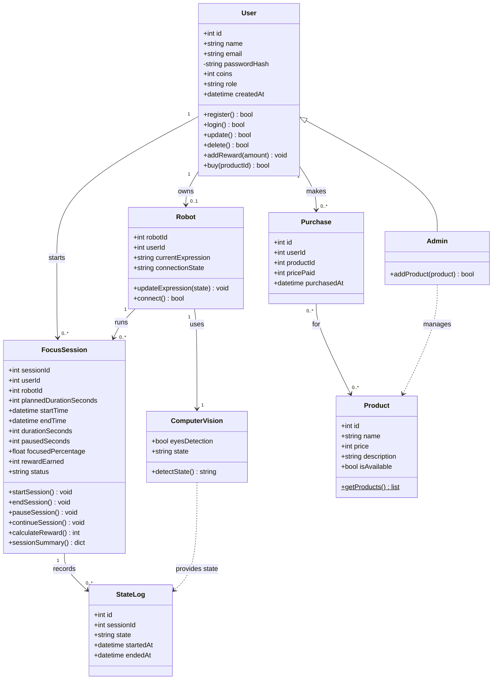
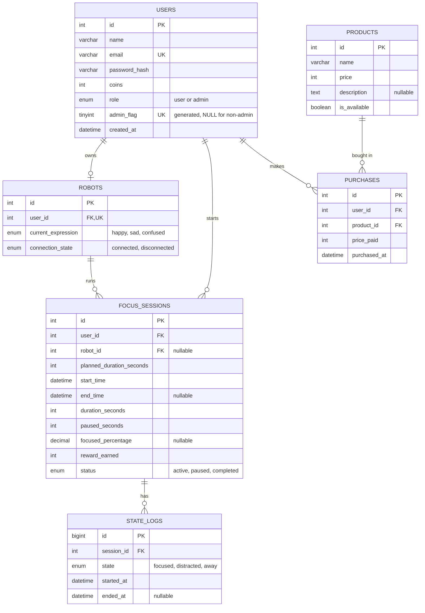
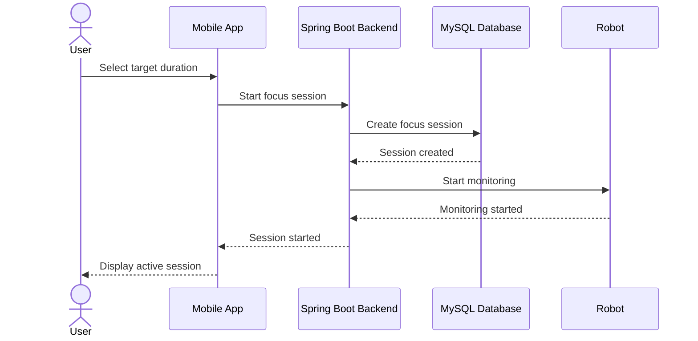
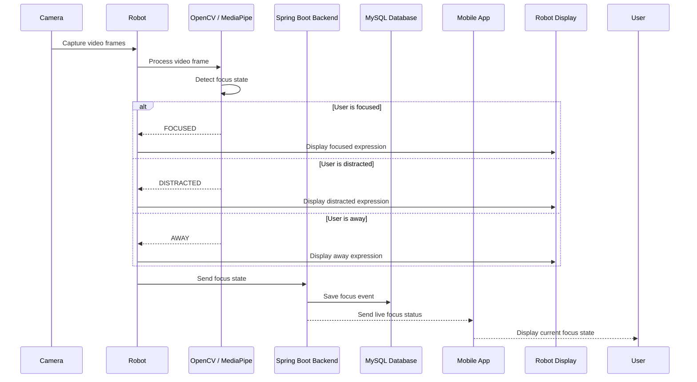
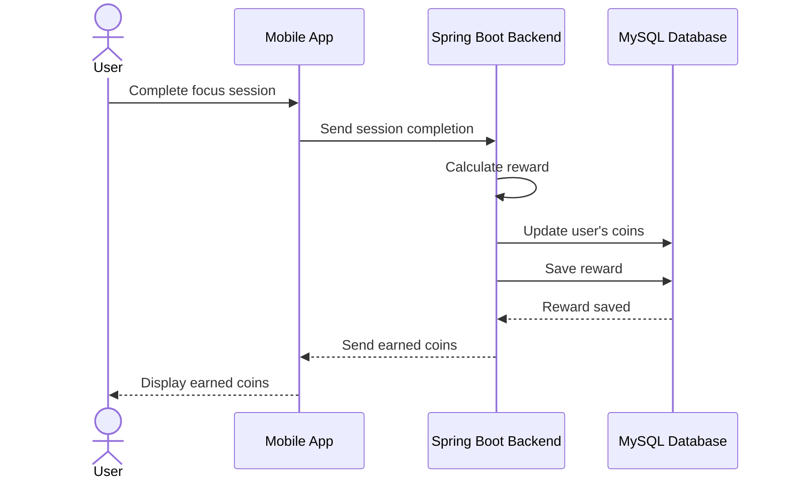

# FocusRobot — Technical Documentation

## 1. User Stories and Mockups

### User Stories (MoSCoW)

### Must Have
1. As a user, I want to register as a new user, so that I can create an account and use the application.

2. As a user, I want to log in with my email and password, so that I can securely access my account, my robot, and my session history.

3. As a user, I want to connect my mobile app to the robot, so that the app can communicate with and control my robot during focus sessions.

4. As a user, I want to start a focus session and select a target duration, so that I can begin working with a clear, time-bound goal.

5. As a user, I want the robot to detect whether I'm FOCUSED, DISTRACTED, or AWAY, so that my attention is tracked accurately without manual input.

6. As a user, I want the robot's screen to show a facial expression matching my current focus state, so that I get immediate, non-intrusive feedback.

7. As a user, I want to see my live session status in the mobile app, so that I can monitor progress alongside the robot's feedback.

8. As a user, I want to receive coins when I complete a session, so that I feel rewarded for staying focused.

9. As a user, I want the app to confirm when a session ends (completed or cut short), so that I know the outcome clearly.
   
10. As a user, I want to spend earned coins to customize the robot with clothes and accessories, so that I feel a sense of progression and ownership.

11. As a user, I want a short summary after each session (e.g., time focused vs. distracted), so that I understand how well I actually focused.

### Should Have
1. As a user, I want to view a history of past sessions, so that I can track my focus trends over time.

2. As a user, I want to pause a session, so that I can take a short break without losing my progress or streak.

3. As a user, I want different expression "themes" for the robot, so that I can personalize how it communicates with me.

### Could Have
1. As a user, I want to set daily or weekly focus goals, so that I can build consistent study habits.

2. As a user, I want to compare my stats with friends, so that I stay motivated through light competition.

3. As a user, I want a gentle audio or light cue when I'm distracted, so that I can self-correct without a jarring interruption.

### Won't Have
1. As a user, I want the robot to physically move or gesture, so that it feels more lifelike — out of scope for a simple 3D-printed prototype.

2. As a user, I want the robot to sync with third-party calendars, so that sessions are scheduled automatically.

3. As a user, I want multiple user profiles on one robot, so that my family/roommates can each track their own sessions.

4. As a user, I want voice control, so that I can start/stop sessions hands-free.

### Mockups

Interactive Figma prototype: [FocusRobot (Kaboom) Mockups](https://www.figma.com/design/av0ip8R6icJggihhZaXFMo/Kaboom-?node-id=1-3&p=f&t=6P1tw5wPOf7ddRQe-0)

#### Mockup overview

| Screen | Preview | Covers |
|---|---|---|
| Sign Up |  | Must Have 1 (register) |
| Login |  | Must Have 2 (account access) |
| Connect |  | Must Have 2 (pair the robot with the app) |
| Homepage |  | Must Have 3 (select a target duration and start a session) |
| Focused Status in Session |  | Must Have 4, 5, 6 (focus state, expression, live status) |
| Distracted Status in Session |  | Must Have 4, 5, 6 |
| Session Complete |  | Must Have 7, 8, 10 (coins earned, outcome, summary) |
| Shop |  | Must Have 9 (spend coins on hats, screens and effects) |


# FocusRobot: Components, Classes, and Database Design

**Tech stack:** MySQL 8 (database)

---

## Table of Contents

1. [System Architecture](#1-system-architecture)
2. [Class Diagram](#2-class-diagram)
3. [ER Diagram](#3-er-diagram)
4. [Database Schema (MySQL 8)](#4-database-schema-mysql-8)


---
## 1. System Architecture


## 2. Class Diagram



---

## 3. ER Diagram



**Relationships**

- User 1 : 0..1 Robot
- User 1 : N FocusSession
- Robot 1 : N FocusSession
- FocusSession 1 : N StateLog
- User M : N Product (through `purchases`)

---

## 4. Database Schema (MySQL 8)

Create the tables in this order because of the foreign keys.

```sql
CREATE TABLE users (
    id INT AUTO_INCREMENT PRIMARY KEY,
    name VARCHAR(100) NOT NULL,
    email VARCHAR(255) NOT NULL UNIQUE,
    password_hash VARCHAR(255) NOT NULL,
    coins INT NOT NULL DEFAULT 0 CHECK (coins >= 0),
    role ENUM('user','admin') NOT NULL DEFAULT 'user',
    admin_flag TINYINT GENERATED ALWAYS AS (IF(role = 'admin', 1, NULL)) VIRTUAL,
    created_at DATETIME NOT NULL DEFAULT CURRENT_TIMESTAMP,
    UNIQUE KEY uq_single_admin (admin_flag)
);

CREATE TABLE robots (
    id INT AUTO_INCREMENT PRIMARY KEY,
    user_id INT NOT NULL UNIQUE,
    current_expression ENUM('happy','sad','confused') NOT NULL DEFAULT 'happy',
    connection_state ENUM('connected','disconnected') NOT NULL DEFAULT 'disconnected',
    FOREIGN KEY (user_id) REFERENCES users(id) ON DELETE CASCADE
);

CREATE TABLE focus_sessions (
    id INT AUTO_INCREMENT PRIMARY KEY,
    user_id INT NOT NULL,
    robot_id INT NULL,
    planned_duration_seconds INT NOT NULL DEFAULT 1800,
    start_time DATETIME NOT NULL,
    end_time DATETIME NULL,
    duration_seconds INT NOT NULL DEFAULT 0,
    paused_seconds INT NOT NULL DEFAULT 0,
    focused_percentage DECIMAL(5,2) NULL,
    reward_earned INT NOT NULL DEFAULT 0,
    status ENUM('active','paused','completed') NOT NULL DEFAULT 'active',
    FOREIGN KEY (user_id) REFERENCES users(id) ON DELETE CASCADE,
    FOREIGN KEY (robot_id) REFERENCES robots(id) ON DELETE SET NULL
);

CREATE TABLE state_logs (
    id BIGINT AUTO_INCREMENT PRIMARY KEY,
    session_id INT NOT NULL,
    state ENUM('focused','distracted','away') NOT NULL,
    started_at DATETIME NOT NULL,
    ended_at DATETIME NULL,
    FOREIGN KEY (session_id) REFERENCES focus_sessions(id) ON DELETE CASCADE
);

CREATE TABLE products (
    id INT AUTO_INCREMENT PRIMARY KEY,
    name VARCHAR(100) NOT NULL,
    price INT NOT NULL CHECK (price > 0),
    description TEXT NULL,
    is_available BOOLEAN NOT NULL DEFAULT TRUE
);

CREATE TABLE purchases (
    id INT AUTO_INCREMENT PRIMARY KEY,
    user_id INT NOT NULL,
    product_id INT NOT NULL,
    price_paid INT NOT NULL,
    purchased_at DATETIME NOT NULL DEFAULT CURRENT_TIMESTAMP,
    FOREIGN KEY (user_id) REFERENCES users(id) ON DELETE CASCADE,
    FOREIGN KEY (product_id) REFERENCES products(id) ON DELETE RESTRICT
);
```




---

## 4. API Mapping

| Action | Endpoint |
|---|---|
| Register / Login | `POST /auth/register` / `POST /auth/login` |
| User data | `GET/PUT/DELETE /users/me` |
| Robot | `POST /robot/connect`, `GET /robot` |
| Start session | `POST /sessions` |
| Pause / Continue / End | `PATCH /sessions/{id}/pause`, `/continue`, `/end` |
| History and summary | `GET /sessions`, `GET /sessions/{id}` |
| Products | `GET /products`, `POST /products` (admin) |
| Purchase | `POST /purchases` |
